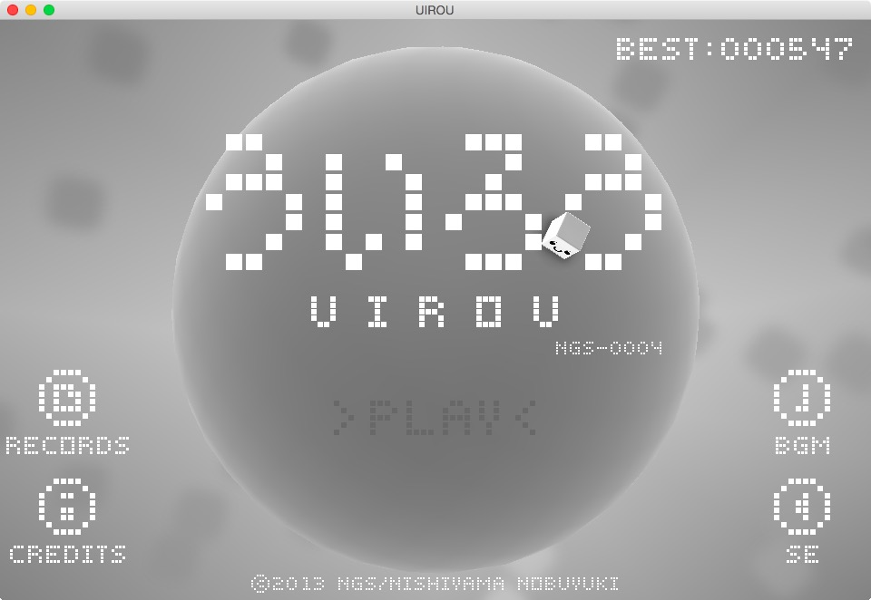

# UIROU

## 概要
2013年に発表した自主製作ゲーム。 本格的にC++で書いたアプリの２作目。OpenGLのシェーダーにも挑戦しました。

+ [iOSアプリ ういろう](https://appsto.re/i6F42Ft)
+ [iOSアプリ ういろう LITE](https://appsto.re/i6F43xJ)

iOS、OSX、Windowsの３つの環境で動作します。

本作の解説本も併せてどうぞ。

+ [ういろうのレシピ(Kindle版)](http://goo.gl/AwzpPB)
+ [ういろうのレシピ(iBooks版)](https://itun.es/jp/GrM_U.l)

## 動作環境
+ OSX

  Xcode5以降

+ Windows

  VisualStudio2015

## あそびかた
- 攻撃

	惑星上で左クリック

- 惑星の回転

	左ドラッグ

- 惑星の拡大縮小

	SHIFTキーを押しながら左ドラッグ

## 利用した外部ライブラリ
+ OpenGL
+ GLFW 2.7.9
+ GLEW
+ OpenAL
+ libpng 1.6.21
+ zlib 1.2.8
+ assimp 3.1
+ ogg, oggvorbis
+ tremor

## License
License All source code files are licensed under the MPLv2.0 license
[MPLv2.0](https://www.mozilla.org/MPL/2.0/)
